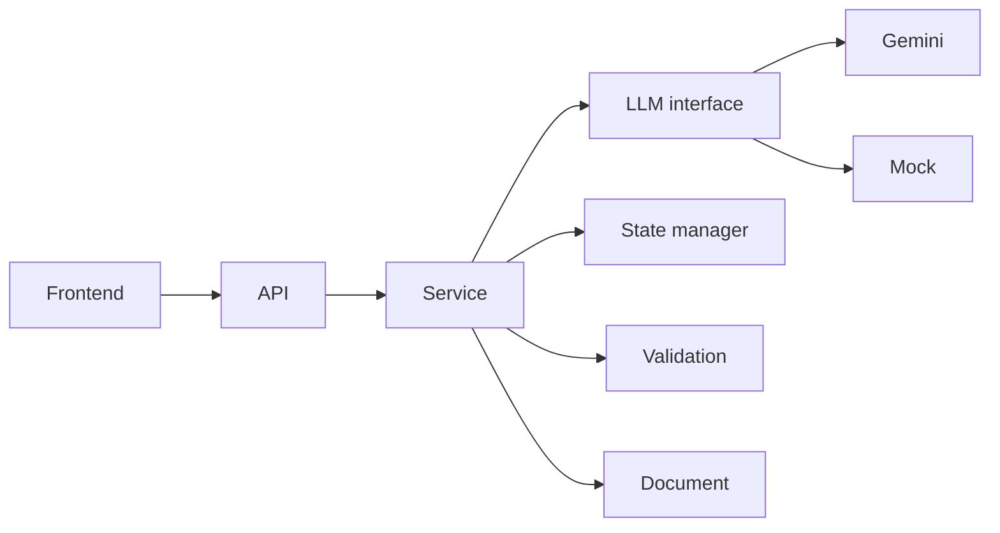

# document-intake-assistant
Document Intake Assistant is a Python-based app that collects structured user information through a conversational workflow and turns confirmed responses into a clean, deterministic personal wishes document.

## Overview

A small fictional intake app that interviews a user and renders a draft Personal Wishes Document. It is a technical assessment/demo, not legal advice or a source of legal content. The app uses structured state—not the chat transcript—as the source of truth.

## Features mapped to the assessment requirements

| Requirement | Implementation |
|---|---|
| Typed state and LLM response contract | `app/schemas.py` |
| Validate model proposals before state changes | `app/validation.py`, `app/state_manager.py` |
| Deterministic draft from confirmed state | `app/document.py` |
| Provider interface, demo mock, Gemini adapter | `app/llm/` |
| Session and conversation orchestration | `app/store.py`, `app/service.py` |
| JSON API and plain browser frontend | `app/main.py`, `static/` |

## Architecture

The API layer calls the conversation service. The service coordinates the provider interface and delegates validation, state rules, session storage, and document rendering to separate modules.



## Data model

Each tracked value has `value` and `status`. Status is `missing`, `unconfirmed`, or `confirmed`. Confirmed empty lists represent an explicit answer of “none”; missing values remain `null`.

Example:

```json
{
  "full_name": {"value": "Jane Smith", "status": "confirmed"},
  "has_children": {"value": false, "status": "confirmed"},
  "children_names": {"value": null, "status": "missing"}
}
```

The complete Pydantic model is `CollectedState` in `app/schemas.py`.

## API contract

| Method and path | Request | Successful response |
|---|---|---|
| `POST /api/sessions` | No body | `201 {"session_id":"…","assistant_message":"…","state":{…},"document":"…","warnings":[]}` |
| `POST /api/sessions/{id}/messages` | `{"message":"My name is Jane Smith"}` | `200 {"assistant_message":"…","state":{…},"document":"…","warnings":[]}` |
| `GET /api/sessions/{id}` | No body | `200 {"session_id":"…","state":{…},"document":"…"}` |
| `GET /api/health` | No body | `200 {"status":"ok","llm_provider":"mock","llm_configured":true}` |

Errors use `{"error":{"code":"…","message":"…"}}`. Codes include `VALIDATION_ERROR` (422), `SESSION_NOT_FOUND` (404), `LLM_TIMEOUT` (504), `LLM_UNAVAILABLE` and `LLM_NOT_CONFIGURED` (503), `LLM_BAD_RESPONSE` (502), and `INTERNAL_ERROR` (500). Interactive schemas are served at `/docs`.

## How a turn works

1. The API validates the incoming message and passes it to the conversation service.
2. The service loads the session and calculates fields needing attention.
3. The prompt builder sends structured state, recent messages, targets, and conflicts to the LLM interface.
4. The provider returns raw text; output validation parses it against `LLMTurnResult`.
5. State rules validate/coerce proposed values and produce an updated copy.
6. Only after success does the service save state, conflicts, and history, then render the deterministic draft.
7. The API returns the assistant reply, state, document, and warnings.

## Setup

Python 3.13 is the tested development runtime (the `google-genai` dependency requires Python 3.10 or newer).

Create and activate a virtual environment, then install dependencies:

```powershell
py -3.13 -m venv .venv
.\.venv\Scripts\Activate.ps1
pip install -r requirements.txt
Copy-Item .env.example .env
```

For the local mock, set `LLM_PROVIDER=mock` in `.env`, then start the server:

```powershell
uvicorn app.main:app --reload
```

For Gemini, set `LLM_PROVIDER=gemini`, `GEMINI_API_KEY`, and `GEMINI_MODEL` in `.env`. Keep the key private; model availability depends on the provider. Then run the same server command. The root page serves the frontend and `/docs` shows the API contract.

Run tests:

```powershell
pytest
```

## Using the mock and replacing a provider

The rule-based mock works without credentials and provides predictable demo behavior; it is deliberately not real natural-language understanding. To add another provider, implement `LLMClient.generate(request)` and return raw model text; keep parsing and state mutation in their existing layers.

## Testing

Pytest covers schemas, state transition and conflict rules, output parsing, prompts, mock and Gemini adapter behavior with fakes, API errors and routes, service retries and persistence, and end-to-end conversation scenarios. Tests do not call real provider APIs.

## Design decisions

- Structured state is authoritative; history is context only.
- Per-field statuses distinguish absent, uncertain, and user-confirmed information.
- Proposed model updates are validated before they can affect state.
- Document output is deterministic and uses confirmed values.
- Retry behavior is bounded; session state is saved only after a successful turn.
- The frontend is plain HTML, CSS, and JavaScript with no build step or framework.

## Known limitations

Sessions are in memory and disappear on restart. The rule-based mock is intentionally limited. Gemini availability and access are controlled by Google. The document is fictional and must not be used as a legal instrument.

## What I would improve for production

Add a persistent database; authentication and per-user sessions; rate limiting; streaming; observability with PII-safe logging; prompt/evaluation regression tests; idempotency keys for duplicate requests; stricter document review; legally reviewed content; CI; and a production deployment setup.
